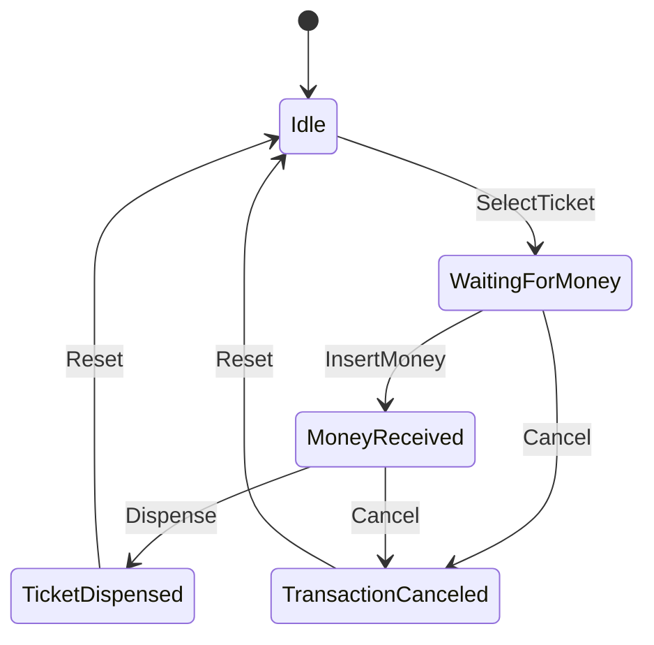

# Диаграмма состояний: Автомат по продаже билетов

## Основные состояния и переходы
1. **Idle** — входное состояние, автомат простаивает.
   - При выборе билета (`SelectTicket`) переходит в **WaitingForMoney**.
2. **WaitingForMoney** — ожидает оплату.
   - При внесении достаточной суммы (`InsertMoney`) переходит в **MoneyReceived**.
   - При отмене (`Cancel`) переходит в **TransactionCanceled**.
3. **MoneyReceived** — средства получены.
   - При подтверждении выдачи (`Dispense`) переходит в **TicketDispensed**.
   - При отмене (`Cancel`) возвращается в **TransactionCanceled**.
4. **TicketDispensed** — билет выдан, автомат возвращается в **Idle**.
5. **TransactionCanceled** — возврат средств (если были) и возврат к **Idle**.

## Mermaid диаграмма

## Дополнительные расширения
- Можно добавить состояние **ChangeReturned** между `MoneyReceived` и `TicketDispensed`, если необходимо выдать сдачу.
- Отслеживание остатков билетов реализуется проверками при входе в состояния `WaitingForMoney` и `MoneyReceived`.

